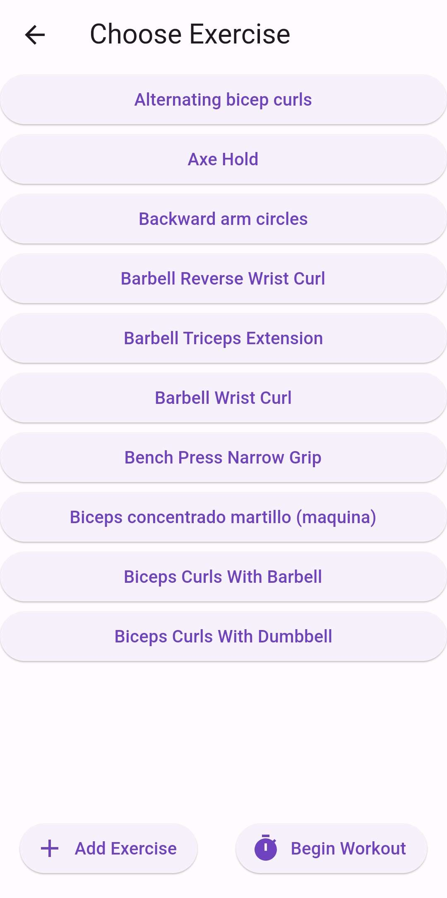

# FitLife Fitness App

FitLife is a fitness application developed with Flutter and Dart. It provides users with a convenient way to track their exercises and view exercise statistics. Additionally, it offers a premium account option that enables users to track water intake and sleep patterns, as well as access comprehensive statistics.

## Features

- Exercise Tracking: Users can easily log their exercises and track their progress over time.
- Exercise Statistics: FitLife calculates exercise statistics to provide insights into workout patterns and progress.
- Premium Account: Activating a premium account unlocks advanced features, including water intake tracking and sleep monitoring.
- Water Tracking: Premium users can track their daily water intake to stay hydrated and monitor their hydration habits.
- Sleep Monitoring: Premium users can monitor their sleep patterns, ensuring they get sufficient rest and optimizing their performance.

## Technologies Used

- Flutter: A UI toolkit for building beautiful and natively compiled applications for mobile, web, and desktop from a single codebase.
- Dart: The programming language used in Flutter for building robust and scalable applications.
- Isar: A local database solution for Flutter applications, providing efficient data storage and retrieval.

## Installation

1. Clone the repository: `git clone https://github.com/SwindleBreeze/FitLife-KD.git`
2. Navigate to the project directory: `cd fitlife`
3. Install dependencies: `flutter pub get`
4. Run the application: `flutter run`

Note: Make sure you have Flutter and Dart installed on your development machine.

## Alternate Installation of Release

If you prefer to install the FitLife app on your Android device without building it from the source code, you can use the provided APK file. Here's how:

1. Go to the [final-apk](/final-apk) folder in the repository.
2. Download the latest release APK file (`app-release.apk`).
3. Transfer the APK file to your Android device.
4. On your Android device, navigate to the location where the APK file is stored.
5. Tap on the APK file to start the installation process.
6. Follow the on-screen instructions to complete the installation.
7. Once the installation is complete, you can launch the FitLife app on your Android device.

Note: Make sure to enable the "Unknown Sources" option in your device's settings to allow the installation of apps from sources other than the Google Play Store.

## Screenshots

*Exercise screen*

*Screen of sleep statistics*

*Sleep Track page*

*Water Intake page*

## Contributing

Contributions to FitLife are welcome! If you encounter any issues or have suggestions for improvements, please feel free to open an issue or submit a pull request.

1. Fork the repository.
2. Create a new branch: `git checkout -b feature/your-feature`
3. Make your changes and commit them: `git commit -m 'Add your feature'`
4. Push to the branch: `git push origin feature/your-feature`
5. Submit a pull request.

## Contact

If you have any questions or inquiries, please feel free to contact us:

- Email: fitlife@example.com
- Website: www.fitlifeapp.com

We appreciate your interest in FitLife and your support in making it better!

## Main Contributors
Edin Ćehić, 63210054 - edinehi53@gmail.com , ec6746@student.uni-lj.si
Amar Mehić, 63210209 - ammar.mehic@gmail.com , am5348@student.uni-lj.si
